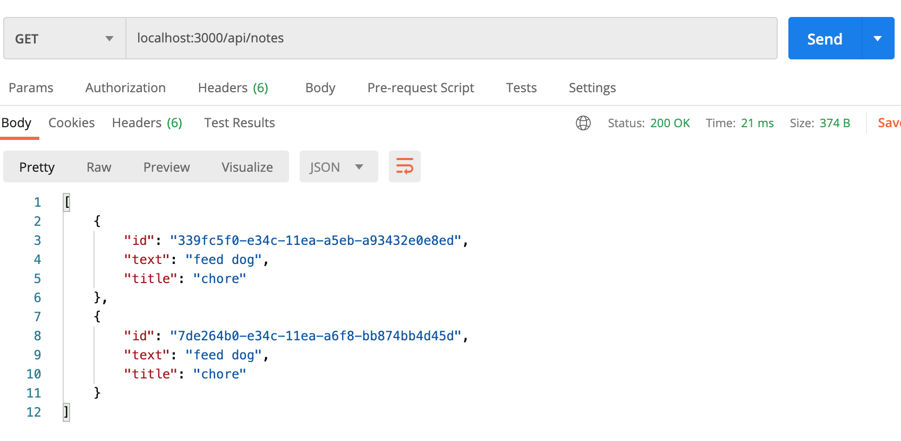
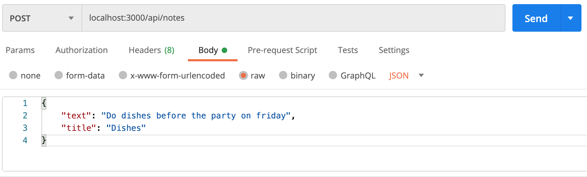
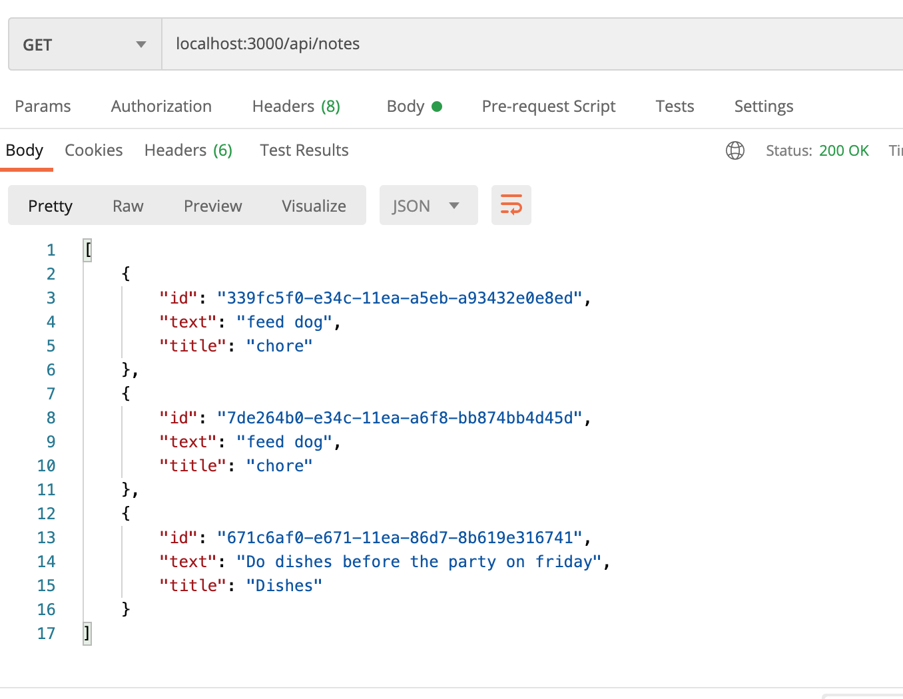
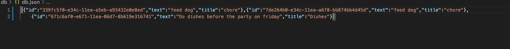

# Template Engine

Created by me: *Danielle Hillman*
Link to repository: https://github.com/daniellehillman/notetaker

## About this application 

This application allows the user to GET, POST, PUT, and DELETE notes with HTTP Methods.

### User can POST a Note with a Title 

This will add that note with title to the array of notes.

### User can GET array

After adding the note, the user can get array with updated note.

### Output

This is will then update with all the items into the Database JSON file.

### Delete and Post

Along with GET and POST, the user can PUT and DELETE notes in the array.
